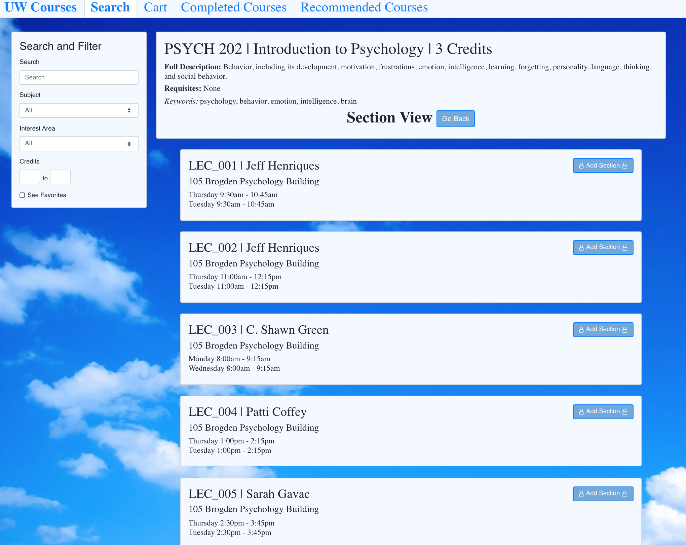
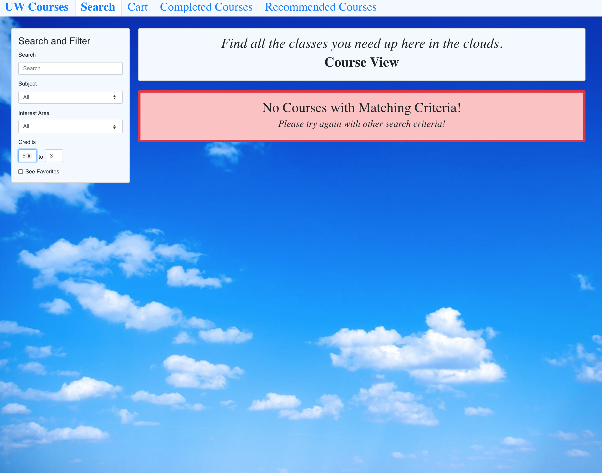
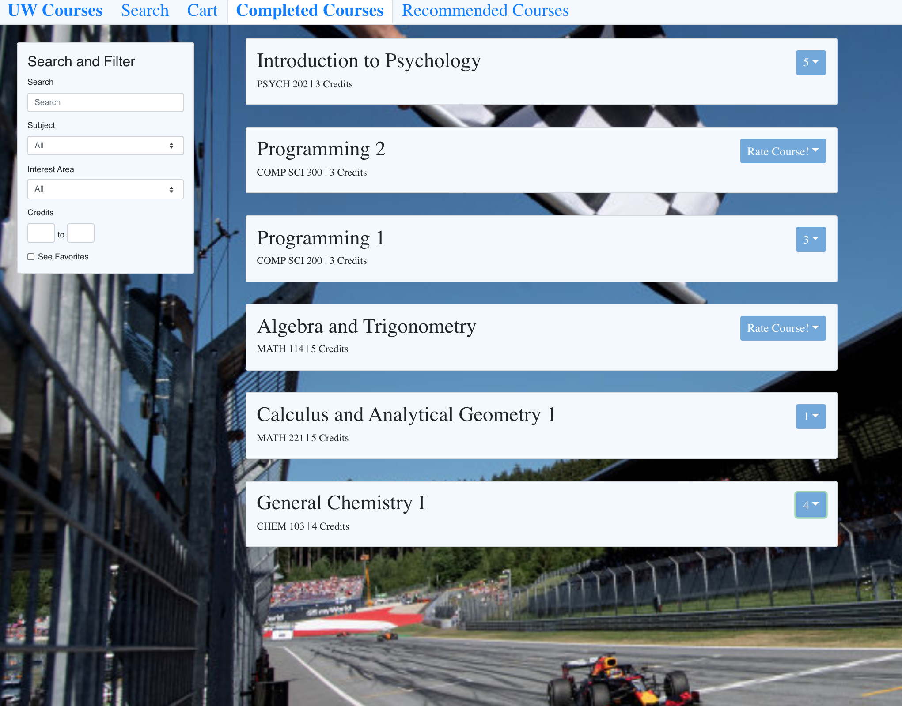
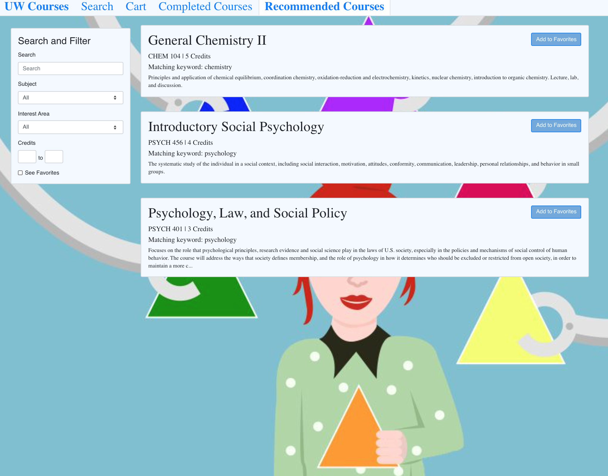

# Course Scheduler
University course web application developed with ReactJS. Implemented the UI with a multi-level, pan & zoom navigation model and conducted usability inspection with heuristic evaluation. Features include search filtering, ratings and recommendations, prerequisite checks, and more.

<table>
  <tr>
    <td>FilterCourses View</td>
  </tr>
  <tr>    
      <td></td>
</tr>
  <tr>     
      <td>Section View</td>
</tr>
  <tr>    
      <td></td>
</tr>
  <tr>        
      <td>Error Message</td>
</tr>
  <tr>        <td></td>
  </tr>
  <tr>
        <td> Cart View</td>
  </tr>
  <tr>
      <td></td>
  </tr>
  <tr>
     <td>RateCourses View</td>
  </tr>
  <tr>
      <td></td>
  </tr>
   <tr>
     <td>RecommendedCourses View</td>
  </tr>
  <tr>
    <td></td>
  </tr>
 </table>

# API
The API is protected by a VPN, but the course data is in the following format:

```
[
    {
        "credits": <number of credits for the course>,
        "description": <course description>,
        "keywords": <1D list of string keywords>,
        "name": <course name>,
        "number": <unique course number>,
        "requisites": <2D list of course requisites>,
        "sections": [
            {
                "instructor": <instructor name>,
                "location": <section location>,
                "subsections": [
                    {
                        "location": <subsection location>,
                        "time": {
                            <weekday>: <time range>, ...
                        },
                        "number": <subsection number>
                    }
                ],
                "time": {
                <weekday>: <time range>, ...
                },
                "number": <section number>
            }, ...
        ],
        "subject": <course subject>
    }, ...
]
```

